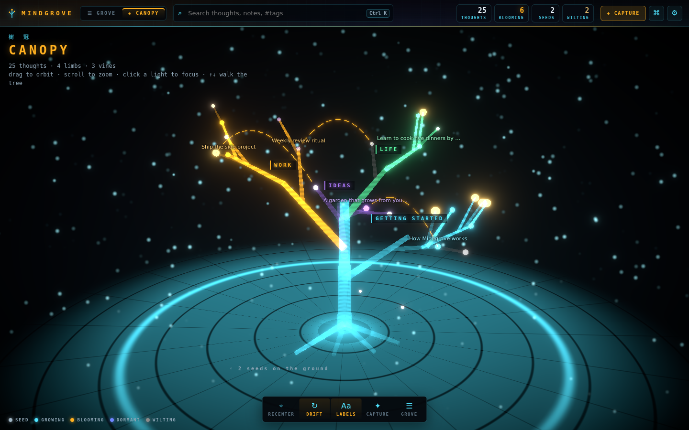
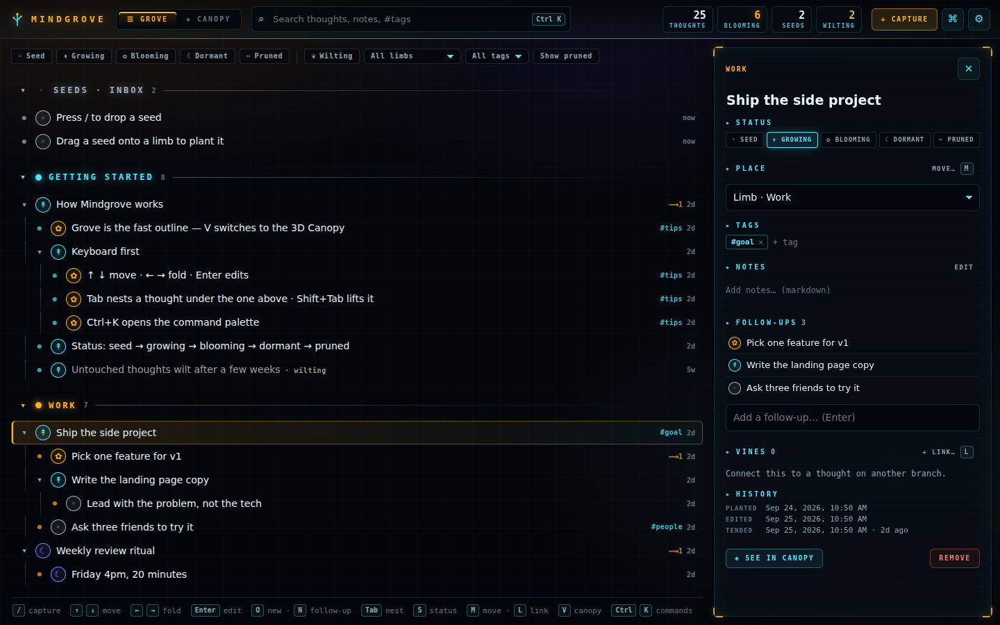
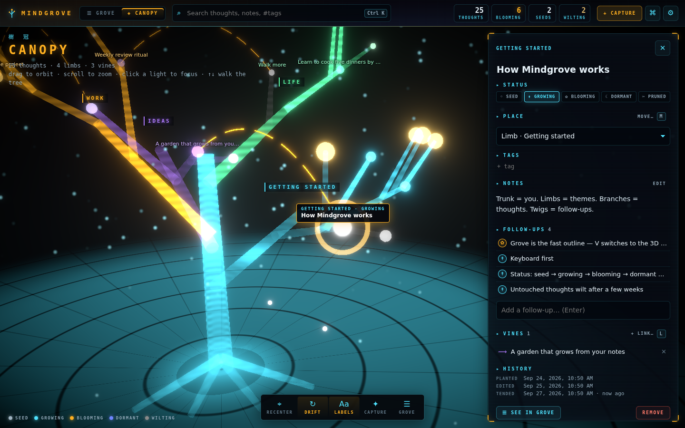
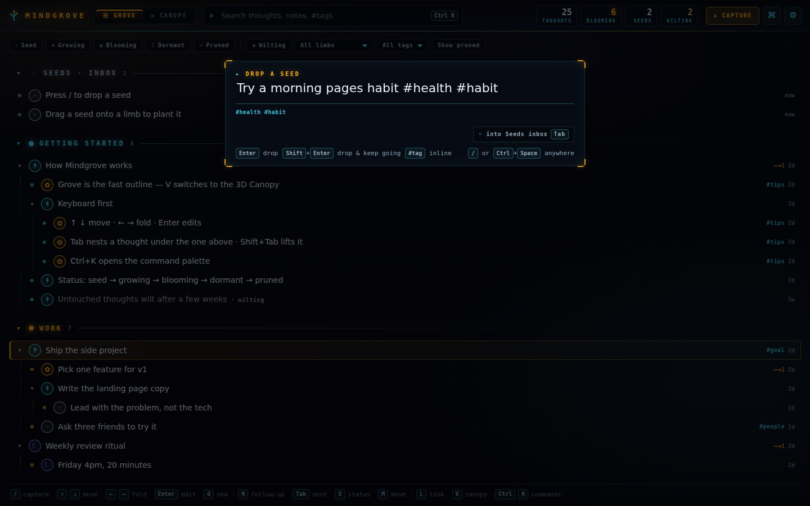
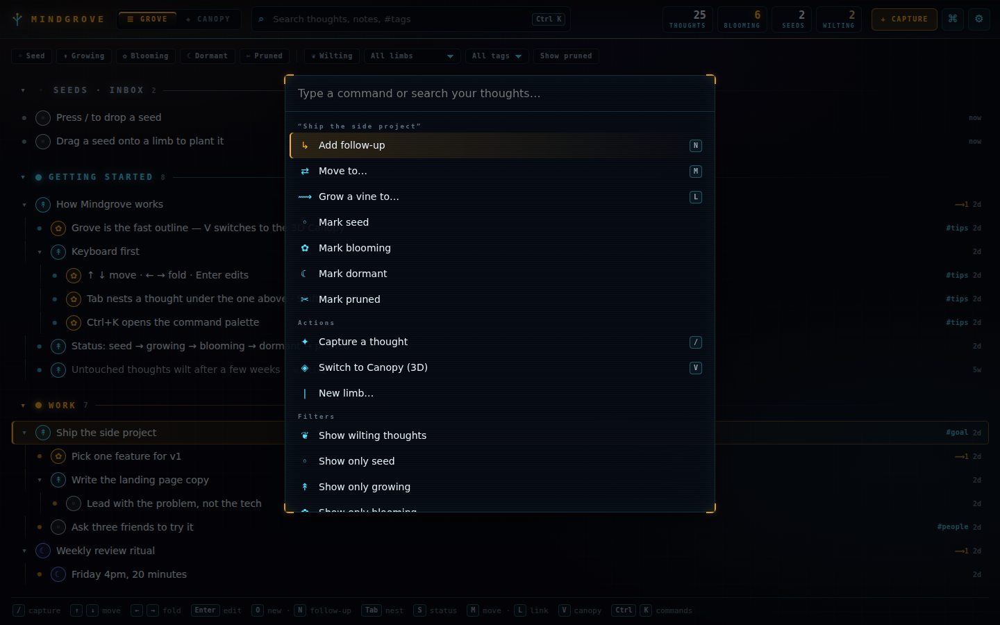
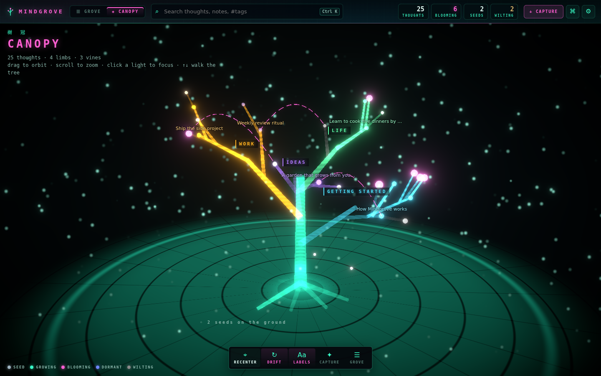
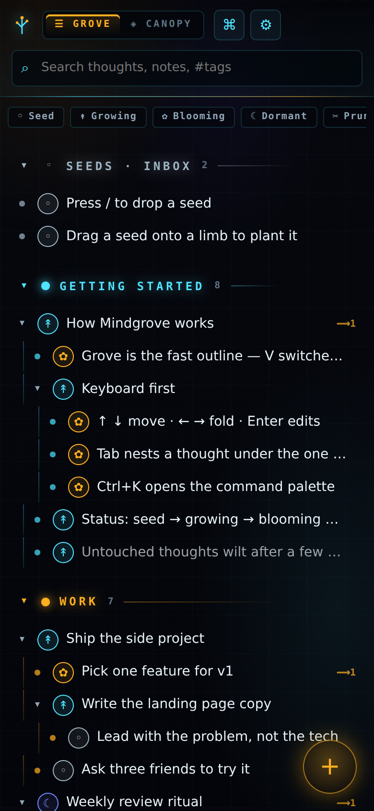
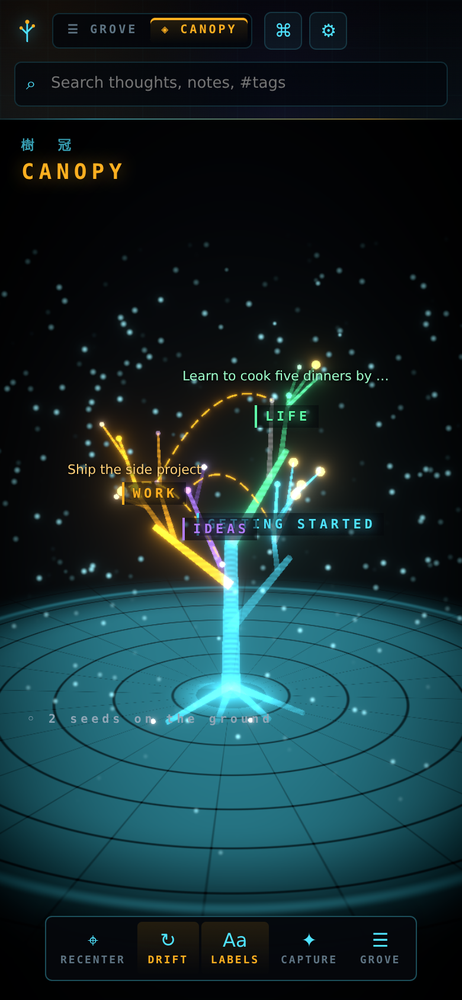

# Mindgrove

A living tree of your thoughts. Capture a thought in under three seconds, then watch it grow into branches and twigs in a clean outline (the **Grove**) or explore it as an immersive holographic tree (the **Canopy**).



| Grove (everyday use) | Canopy focus |
| --- | --- |
|  |  |
| **Quick capture** | **Command palette** |
|  |  |
| **Themes** | **Phone** |
|  |   |

## The metaphor

| Tree part | Meaning |
| --- | --- |
| Trunk | You |
| Limbs | Themes / domains you create (Work, Life, Ideas…) |
| Branches → twigs | A thought → its follow-ups, any depth |
| Seeds | Quick captures waiting in the inbox |
| Vines | Links between thoughts on different branches |
| Blossoms | A thought that became an action, or is done |
| Wilting | Untouched for a few weeks: it fades until you revive or prune it |

Every thought has a status: `seed → growing → blooming → dormant → pruned`.

## Using it

- **Capture:** press `/` (or `Ctrl/⌘+Space`) anywhere, type, then press `Enter`. Add `#tags` inline. `Shift+Enter` keeps the box open so you can dump several thoughts in a row. `Tab` files the thought as a follow-up of the one you have selected. On a phone, use the ＋ button.
- **Grove:** a keyboard-first outline, grouped by limb.
  - `↑ ↓` move · `← →` fold, unfold, or jump to parent · `Enter` rename · `Space` open details
  - `O` new thought below · `N` new follow-up. Once you're editing, `Enter` starts the next one, so you can write a whole list without touching the mouse.
  - `Tab` / `Shift+Tab` nest or lift out · `Alt+↑ ↓` reorder · `S` cycle status · `X` prune
  - `M` move to a limb or thought · `L` grow a vine · `Del` remove (you get an undo toast)
  - Drag rows to re-parent them. Drop on the top or bottom edge of a row to place before or after it, in the middle to nest under it, or on a limb or Seeds header to plant it there.
  - Search and filter by status, tag, limb, or wilting.
- **Canopy:** press `V`. Drag to orbit, scroll to zoom, click a light to fly to it and open it. The arrow keys still walk the tree, because selection is shared between the two views.
- **Command palette:** `Ctrl/⌘+K` for every action and for jumping to any thought.
- **Settings** (`?`): three themes (cyan holo, bioluminescent, aurora), reduced motion, particle level, when thoughts start to wilt, limb names and colours, and the keyboard reference.

## Your data

Everything is stored locally in your browser (IndexedDB). No account and no server are needed, and it works offline once installed as a PWA.

- **Export Markdown:** gives you a `.zip` with one file per limb plus `Seeds.md`. Each file is a nested list that any editor can read. Hidden comments keep ids and dates, so importing it back loses nothing.
- **Export JSON:** a full backup.
- **Import:** merges `.json`, a Mindgrove `.zip`, or plain `.md` files. Markdown you wrote by hand works too: `# Heading` becomes a limb and each bullet becomes a thought. **Restore backup** replaces everything.

## Development

Requires Node 20+ (CI uses 22).

```bash
npm install
npm run dev        # http://localhost:5173
npm test           # Vitest: store, layout stability, export round-trip, markdown
npm run lint       # prettier --check + tsc
npm run format     # prettier --write
npm run build      # type-check + production build to dist/
npm run preview    # serve the build
```

Stack: Vite, React 19, TypeScript, Zustand (state), Dexie (IndexedDB), react-three-fiber, drei and @react-three/postprocessing (Canopy), vite-plugin-pwa, Vitest.

```
src/
  model/     types + pure tree helpers (outline, filters, wilting, capture parsing)
  store/     Zustand store (write-behind persistence to Dexie) + first-run demo tree
  db/        Dexie schema
  io/        Markdown + JSON export/import, tiny store-only zip
  grove/     outline view, visible-row model
  canopy/    seeded layout, holo shaders, instanced scene, projected labels
  ui/        HUD, detail panel, capture, palette, settings, hotkeys, themes
  lib/       ids/PRNG, markdown renderer, fx particles, key helpers
```

Design notes:

- **Stable layout.** Each segment's position comes only from its own id and its ancestors, never from its siblings. Adding thoughts never moves existing ones, and a test checks this.
- **Fast first load.** three.js loads only when the Canopy first opens. The Grove ships at about 125 KB gzipped.
- **3D performance.** Branches and nodes are instanced meshes. The layout depends only on the tree's structure, so editing a title doesn't rebuild the scene.
- **Look.** The visual language comes from [BruNet](https://github.com/crystalcoves/BruNet): hub panels with amber corner brackets, mono labels, cyan holo lines. Following BruNet's rules, large surfaces use no `backdrop-filter` and no looping animations. Reduced motion is honoured everywhere, including the system setting on first run.

## Deploy (GitHub Pages)

`.github/workflows/deploy.yml` tests, builds with `BASE_PATH=/<repo>/`, and publishes `dist/` on every push to `main`.

One-time setup: in the repository, open **Settings → Pages → Build and deployment → Source** and choose **GitHub Actions**. The app will then be served at `https://<owner>.github.io/mindgrove/`.

To host somewhere else (Vercel, Netlify, any static host), run `npm run build` and serve `dist/`. Leave `BASE_PATH` unset when serving from the domain root.

`.github/workflows/ci.yml` runs the format check, the tests, and the build on pull requests.

## Roadmap

- **v2:** time-lapse replay (growth rings), wilting reminders, vine suggestions
- **v3:** voice capture, mobile share-target, optional sync
- AI placement suggestions are intentionally deferred.

See [PLAN.md](PLAN.md) for the design brief.
